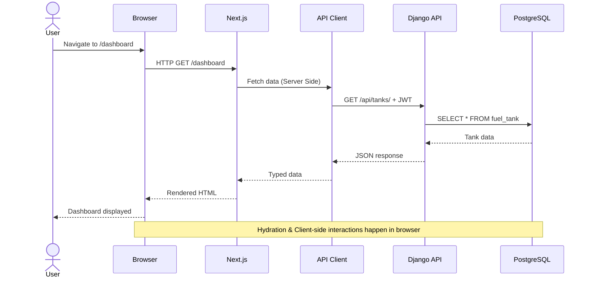
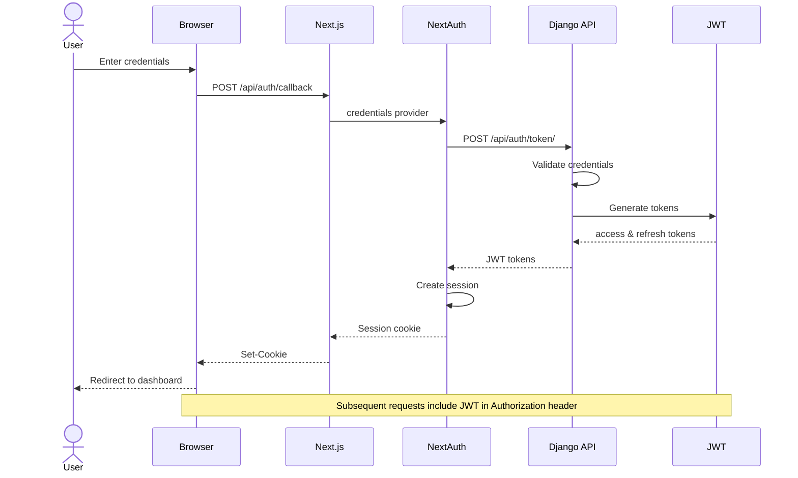
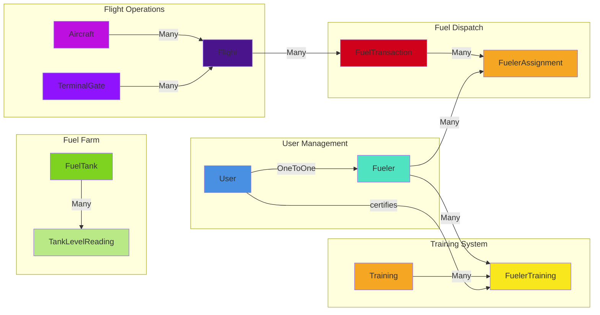
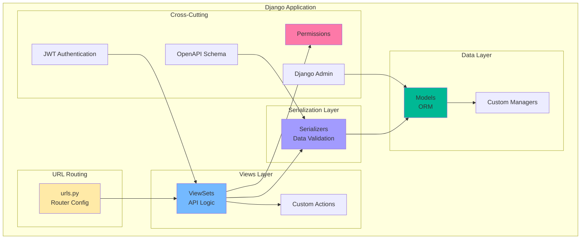
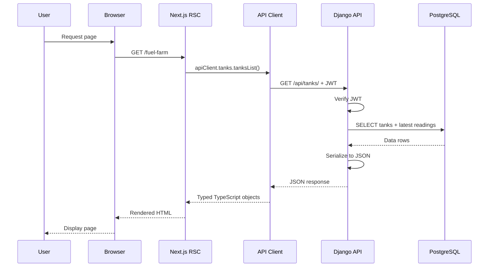
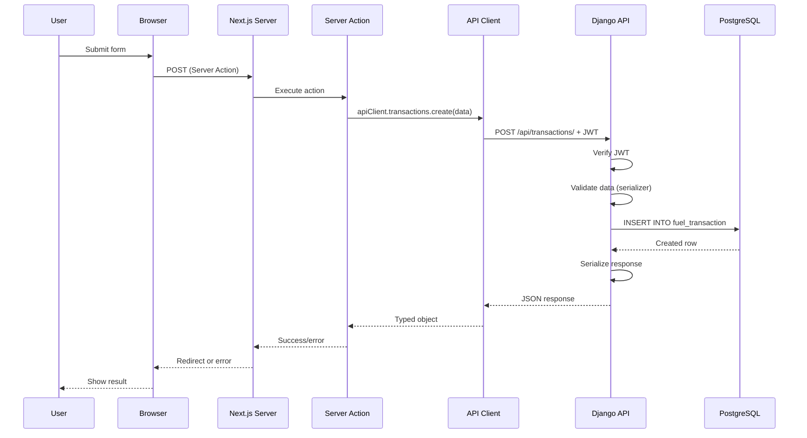
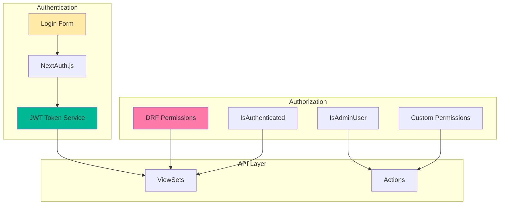

# FBO Manager - Architecture Documentation

**System Design & Technical Architecture**

---

## Table of Contents

1. [System Overview](#system-overview)
2. [Architecture Diagrams](#architecture-diagrams)
3. [Component Details](#component-details)
4. [Data Flow](#data-flow)
5. [Security Architecture](#security-architecture)
6. [Deployment Architecture](#deployment-architecture)
7. [Design Patterns](#design-patterns)
8. [Technology Decisions](#technology-decisions)

---

## System Overview

FBO Manager is a full-stack web application built with a **separated frontend-backend architecture**:

- **Backend:** Django REST Framework API (Python)
- **Frontend:** Next.js 15 with App Router (React 19)
- **Database:** PostgreSQL (Supabase managed)
- **Authentication:** JWT tokens
- **Communication:** REST API with OpenAPI

### Architecture Style

**Monorepo with Separated Services:**
- Backend and frontend in one repository
- Each can be deployed independently
- Shared type safety via OpenAPI code generation

---

## Architecture Diagrams

### High-Level System Architecture

```mermaid
graph TB
    subgraph "Client Layer"
        Browser[Web Browser]
    end

    subgraph "Frontend - Next.js"
        NextJS[Next.js Server]
        RSC[React Server Components]
        SA[Server Actions]
        ApiClient[OpenAPI Client]
    end

    subgraph "Backend - Django"
        API[Django REST API]
        ORM[Django ORM]
        Admin[Django Admin]
        OpenAPI[drf-spectacular]
    end

    subgraph "Data Layer"
        DB[(PostgreSQL<br/>Supabase)]
        TankMonitor[(Tank Monitor System)]
    end

    subgraph "External Systems"
        QT[QT Technologies<br/>Dispatch System]
    end

    Browser --> NextJS
    NextJS --> RSC
    NextJS --> SA
    SA --> ApiClient
    ApiClient --> API
    API --> ORM
    API --> OpenAPI
    ORM --> DB
    TankMonitor --> DB
    API --> QT
    Admin --> ORM

    style Browser fill:#e1f5ff
    style NextJS fill:#61dafb
    style API fill:#092e20
    style DB fill:#336791
```



---

### Request Flow Architecture



---

### Authentication Flow



---

### Data Model Architecture



---

### Frontend Architecture

```mermaid
graph TB
    subgraph "Next.js Application"
        subgraph "App Router"
            Auth["(auth)<br/>login, register"]
            Account["(account)<br/>profile, settings"]
            Dashboard["(dashboard)<br/>main app"]
        end

        subgraph "Components"
            UI[UI Components<br/>@frontend/ui]
            Forms[Form Components]
            Layout[Layout Components]
        end

        subgraph "Libraries"
            ApiTypes[@frontend/types<br/>OpenAPI Generated]
            ApiClient[API Client Wrapper]
            AuthLib[NextAuth Config]
            Utils[Utilities]
        end

        subgraph "Server Actions"
            AuthActions[Auth Actions]
            ProfileActions[Profile Actions]
            TxActions[Transaction Actions]
        end
    end

    Dashboard --> UI
    Dashboard --> Forms
    Dashboard --> Layout
    Dashboard --> ApiClient
    Dashboard --> AuthActions

    Forms --> Utils
    ApiClient --> ApiTypes
    AuthActions --> ApiClient

    style Auth fill:#ffeaa7
    style Account fill:#fab1a0
    style Dashboard fill:#74b9ff
    style ApiTypes fill:#00b894
```

---

### Backend Architecture



---

## Component Details

### Backend Components

#### Django REST Framework API

**Purpose:** Provide RESTful API for all FBO operations

**Key Features:**
- ModelViewSets for CRUD operations
- Custom actions for business logic
- Filtering, searching, pagination
- OpenAPI schema generation

**Technologies:**
- Django 5.1
- Django REST Framework 3.15
- drf-spectacular (OpenAPI)
- djangorestframework-simplejwt (JWT)

**Endpoints:** See [API Reference](./API_REFERENCE.md)

---

#### Django ORM

**Purpose:** Database abstraction layer

**Key Features:**
- 11 models for FBO domain
- Foreign key relationships
- Custom validators
- Query optimization (select_related, prefetch_related)

**Database:** PostgreSQL 15+ (Supabase managed)

**Models:** See [Database Schema](./DATABASE_SCHEMA.md)

---

#### Django Admin

**Purpose:** Internal operations dashboard

**Key Features:**
- Custom admin for all models
- Inline editing for related objects
- List filters and search
- django-unfold theme

**Access:** `http://localhost:8000/admin/`

---

### Frontend Components

#### Next.js Application

**Purpose:** User-facing web application

**Key Features:**
- Server Components for performance
- Client Components for interactivity
- Server Actions for form submissions
- File-based routing

**Technologies:**
- Next.js 15.2
- React 19
- TypeScript
- Tailwind CSS

**Pages:**
- `/login`, `/register` - Authentication
- `/dashboard` - Overview
- `/fuel-farm` - Tank monitoring
- `/dispatch` - Fuel orders
- `/flights` - Flight tracking
- `/training` - Certifications

---

#### OpenAPI Type Generation

**Purpose:** Ensure type safety between frontend and backend

**Process:**
1. Backend: drf-spectacular generates OpenAPI schema from serializers
2. Frontend: openapi-typescript-codegen generates TypeScript types and client
3. Result: Compile-time type checking for API calls

**Example:**
```typescript
// Fully typed API call
const tanks = await apiClient.tanks.tanksList()
// tanks has correct TypeScript type inferred from backend
```

---

#### NextAuth.js

**Purpose:** Authentication management for Next.js

**Configuration:**
- Credentials provider (username/password)
- JWT strategy (stateless)
- Custom callbacks for user data
- Session management

**Flow:**
1. User submits login form
2. NextAuth calls Django `/api/auth/token/`
3. Django returns JWT tokens
4. NextAuth stores in session
5. Subsequent API calls include JWT in Authorization header

---

## Data Flow

### Read Data Flow (GET Request)



---

### Write Data Flow (POST Request via Server Action)



---

## Security Architecture

### Authentication & Authorization



### Security Layers

| Layer | Technology | Purpose |
|-------|-----------|---------|
| **Transport Security** | HTTPS (production) | Encrypt data in transit |
| **Authentication** | JWT (simplejwt) | Verify user identity |
| **Authorization** | DRF Permissions | Control resource access |
| **CSRF Protection** | Django CSRF (disabled for API) | Protect against cross-site attacks |
| **SQL Injection** | Django ORM | Parameterized queries |
| **XSS Protection** | React (auto-escaping) | Prevent script injection |
| **Password Hashing** | PBKDF2 (Django default) | Secure password storage |

### Security Best Practices

1. **Never commit secrets** - Use environment variables
2. **Use HTTPS in production** - TLS 1.2+
3. **Rotate JWT secrets regularly** - Update NEXTAUTH_SECRET
4. **Set short JWT expiry** - Access tokens expire in 15 minutes
5. **Use refresh tokens** - Long-lived refresh tokens for reauthentication
6. **Validate all inputs** - Serializer validation on backend
7. **Rate limit API** - TODO: Add rate limiting before production
8. **Audit logging** - TODO: Log security events

---

## Deployment Architecture

### Development Environment

```mermaid
graph TB
    subgraph "Docker Compose"
        API[API Container<br/>Port 8000]
        Web[Web Container<br/>Port 3000]
    end

    subgraph "External Services"
        DB[(Supabase PostgreSQL)]
    end

    Dev[Developer Machine]

    Dev -->|docker-compose up| API
    Dev -->|docker-compose up| Web
    API -->|psycopg| DB
    Web -->|HTTP| API

    style API fill:#092e20
    style Web fill:#61dafb
    style DB fill:#336791
```



### Production Architecture (Planned)

```mermaid
graph TB
    subgraph "Cloud Provider"
        LB[Load Balancer]

        subgraph "Frontend"
            Next1[Next.js Instance 1]
            Next2[Next.js Instance 2]
        end

        subgraph "Backend"
            API1[Django API Instance 1]
            API2[Django API Instance 2]
        end

        subgraph "Data Layer"
            DB[(PostgreSQL<br/>Managed)]
            Redis[(Redis<br/>Cache)]
        end

        subgraph "Workers"
            Celery[Celery Workers]
        end
    end

    Users[Users] --> LB
    LB --> Next1
    LB --> Next2
    Next1 --> API1
    Next2 --> API2
    API1 --> DB
    API2 --> DB
    API1 --> Redis
    API2 --> Redis
    Celery --> DB
    Celery --> Redis

    style LB fill:#ffeaa7
    style Next1 fill:#61dafb
    style Next2 fill:#61dafb
    style API1 fill:#092e20
    style API2 fill:#092e20
    style DB fill:#336791
    style Redis fill:#d82c20
```



---

## Design Patterns

### Backend Patterns

#### 1. Model-View-Serializer (MVS)

**Django REST Framework pattern:**

```
Request → ViewSet → Serializer → Model → Database
                ←              ←       ←
```

**Benefits:**
- Clear separation of concerns
- Reusable serializers
- DRY (Don't Repeat Yourself)

---

#### 2. Repository Pattern (Django ORM)

**Django's ORM acts as a repository:**

```python
# Abstraction over database
users = User.objects.filter(is_active=True)
```

**Benefits:**
- Database-agnostic code
- Testable (can mock queryset)
- Query optimization

---

#### 3. Dependency Injection (DRF Permissions)

**Permissions injected into ViewSets:**

```python
class MyViewSet(viewsets.ModelViewSet):
    permission_classes = [IsAuthenticated]
```

**Benefits:**
- Flexible authorization
- Testable (can mock permissions)
- Reusable permission classes

---

### Frontend Patterns

#### 1. Component Composition

**React components compose to build UI:**

```tsx
<DashboardLayout>
  <FuelFarmSection>
    <FuelTankCard tank={tank} />
  </FuelFarmSection>
</DashboardLayout>
```

**Benefits:**
- Reusable components
- Separation of concerns
- Testable in isolation

---

#### 2. Server Components + Client Components

**Next.js 15 pattern:**

```tsx
// Server Component (default) - runs on server
export default async function Page() {
  const data = await fetchData() // Direct API call
  return <ClientComponent data={data} />
}

// Client Component - runs in browser
'use client'
export function ClientComponent({ data }) {
  const [state, setState] = useState(data)
  // Interactive logic
}
```

**Benefits:**
- Reduced client JavaScript
- Better performance
- Improved SEO

---

#### 3. Server Actions

**Next.js form handling:**

```tsx
'use server'
export async function submitFormAction(formData: FormData) {
  // Server-side logic
  const result = await apiClient.create(data)
  revalidatePath('/dashboard')
  return result
}
```

**Benefits:**
- No client-side API calls
- Automatic CSRF protection
- Progressive enhancement

---

## Technology Decisions

### Why Django?

**Pros:**
- ✅ Excellent ORM for relational data
- ✅ Built-in admin interface
- ✅ Mature ecosystem (DRF, drf-spectacular)
- ✅ Security best practices built-in
- ✅ Great for data-heavy applications

**Cons:**
- ❌ Synchronous by default (async support improving)
- ❌ Monolithic (but we separated frontend)

**Alternative considered:** FastAPI
- Faster, async, modern
- But lacks admin interface and mature ORM

---

### Why Next.js?

**Pros:**
- ✅ React Server Components (performance)
- ✅ Server Actions (simplified data mutations)
- ✅ File-based routing (intuitive)
- ✅ Image optimization out of the box
- ✅ Easy deployment (Vercel or Docker)

**Cons:**
- ❌ Rapid breaking changes (v13 → v14 → v15)
- ❌ Learning curve for RSC paradigm

**Alternative considered:** Remix
- Similar to Next.js, more focused on web standards
- But smaller ecosystem

---

### Why PostgreSQL?

**Pros:**
- ✅ ACID compliance (critical for FBO operations)
- ✅ Excellent for relational data
- ✅ JSON support (for charge_flags field)
- ✅ Great Django support

**Cons:**
- ❌ More complex to set up than SQLite
- ❌ Requires managed hosting or self-hosting

**Alternative considered:** MongoDB
- NoSQL flexibility
- But FBO domain is highly relational

---

### Why JWT over Session Auth?

**Pros:**
- ✅ Stateless (scales horizontally)
- ✅ Works across domains
- ✅ Mobile-friendly

**Cons:**
- ❌ Cannot revoke tokens (without blacklist)
- ❌ Token size (larger than session ID)

**Mitigation:**
- Short access token expiry (15 min)
- Long-lived refresh tokens
- TODO: Implement token blacklist

---

### Why Monorepo?

**Pros:**
- ✅ Single source of truth
- ✅ Shared tooling (pre-commit, Docker Compose)
- ✅ Atomic changes (backend + frontend in one PR)

**Cons:**
- ❌ Larger repository
- ❌ Requires monorepo tooling (pnpm workspaces)

**Alternative considered:** Separate repos
- Cleaner separation
- But harder to coordinate changes

---

## Performance Considerations

### Backend Optimizations

1. **Query Optimization:**
   - Use `select_related()` for foreign keys (JOIN)
   - Use `prefetch_related()` for reverse FKs (separate queries)

2. **Database Indexing:**
   - Automatic indexes on PKs, FKs, unique fields
   - Consider composite indexes for common queries

3. **Pagination:**
   - Limit results to 10 items per page
   - Reduces payload size

4. **Read-Only ViewSets:**
   - `TankLevelReadingViewSet` is read-only (no write overhead)

### Frontend Optimizations

1. **Server Components:**
   - Render on server, send HTML (less client JS)

2. **Next.js Image:**
   - Automatic optimization, lazy loading

3. **Code Splitting:**
   - Automatic by Next.js (per-route bundles)

4. **Static Generation (where possible):**
   - Pre-render pages at build time

---

## Scalability

### Horizontal Scaling (Planned)

- **Frontend:** Multiple Next.js instances behind load balancer
- **Backend:** Multiple Django API instances (stateless)
- **Database:** PostgreSQL read replicas
- **Cache:** Redis for session storage and API caching
- **Workers:** Celery workers for background tasks

### Bottlenecks to Watch

1. **Database:** Single point of failure
   - Solution: Read replicas, connection pooling

2. **Tank Readings Table:** Growing rapidly
   - Solution: Partitioning by date, archiving old data

3. **QT Technologies API:** External dependency
   - Solution: Queue + retry logic, circuit breaker

---

## See Also

- [Project Overview](./PROJECT_OVERVIEW.md) - High-level overview
- [API Reference](./API_REFERENCE.md) - API endpoints
- [Database Schema](./DATABASE_SCHEMA.md) - Data models
- [Developer Guide](./DEVELOPER_GUIDE.md) - Setup and development

---

**Last Updated:** October 31, 2025
