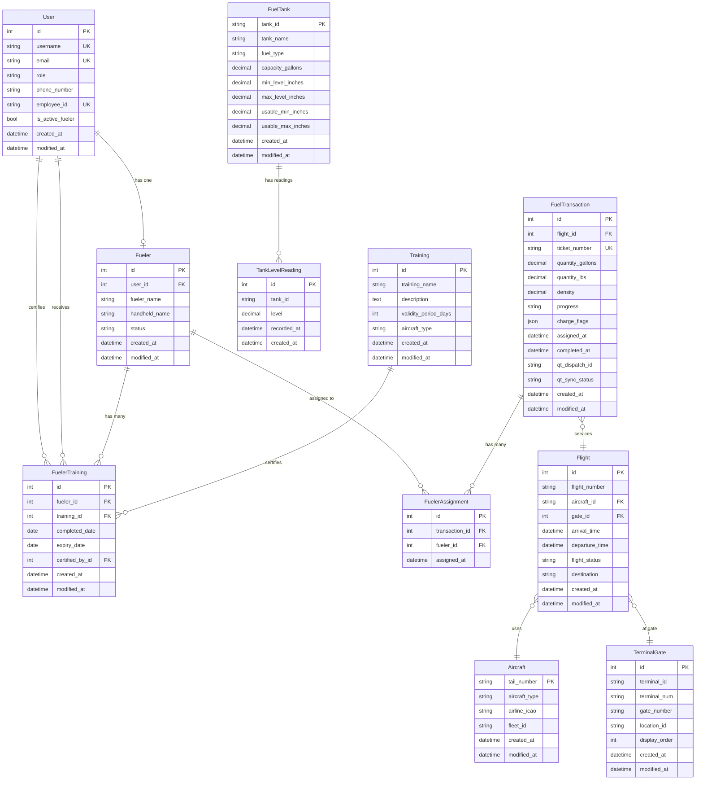

# FBO Manager - Database Schema Documentation

**Version:** 1.0
**Database:** PostgreSQL 15+ (Supabase)
**ORM:** Django 5.1

---

## Table of Contents

1. [Entity Relationship Diagram](#entity-relationship-diagram)
2. [Table Reference](#table-reference)
3. [Relationships](#relationships)
4. [Indexes and Constraints](#indexes-and-constraints)
5. [Field Reference](#field-reference)

---

## Entity Relationship Diagram



---

## Table Reference

### Core Tables

| Table | Purpose | Key Fields | Row Count (Typical) |
|-------|---------|------------|---------------------|
| `users` | User authentication and profiles | username, email, role | 50-100 |
| `fueler` | Fueler employee profiles | user_id, fueler_name, status | 20-50 |
| `training` | Training course definitions | training_name, validity_period_days | 10-20 |
| `fueler_training` | Certification records | fueler_id, training_id, expiry_date | 100-500 |
| `fuel_tank` | Fuel tank configuration | tank_id, fuel_type, capacity | 5-10 |
| `tank_level_readings` | Historical tank levels | tank_id, level, recorded_at | 10,000+ |
| `aircraft` | Aircraft registry | tail_number, aircraft_type | 100-500 |
| `terminal_gate` | Terminal gates | terminal_num, gate_number | 20-50 |
| `flight` | Flight tracking | flight_number, status, times | 1,000-10,000 |
| `fuel_transaction` | Fuel dispatch orders | ticket_number, quantity, progress | 5,000-50,000 |
| `fueler_assignment` | Transaction-to-fueler mapping | transaction_id, fueler_id | 5,000-100,000 |

---

## Relationships

### One-to-One Relationships

| Parent | Child | Relationship | Notes |
|--------|-------|--------------|-------|
| `User` | `Fueler` | 1:1 | A user can have one fueler profile (optional) |

### One-to-Many Relationships

| Parent | Child | Foreign Key | Cascade Behavior |
|--------|-------|-------------|------------------|
| `Fueler` | `FuelerTraining` | `fueler_id` | CASCADE (delete certifications when fueler deleted) |
| `Training` | `FuelerTraining` | `training_id` | CASCADE (delete certifications when training deleted) |
| `User` | `FuelerTraining` | `certified_by_id` | SET NULL (keep cert record if certifier deleted) |
| `FuelTransaction` | `FuelerAssignment` | `transaction_id` | CASCADE (delete assignments when transaction deleted) |
| `Fueler` | `FuelerAssignment` | `fueler_id` | CASCADE (delete assignments when fueler deleted) |
| `Aircraft` | `Flight` | `aircraft_id` | SET NULL (keep flight record if aircraft deleted) |
| `TerminalGate` | `Flight` | `gate_id` | SET NULL (keep flight record if gate deleted) |
| `Flight` | `FuelTransaction` | `flight_id` | SET NULL (keep transaction if flight deleted) |
| `FuelTank` | `TankLevelReading` | `tank_id` | No FK constraint (read-only table) |

### Many-to-Many Relationships

| Table 1 | Table 2 | Junction Table | Notes |
|---------|---------|----------------|-------|
| `FuelTransaction` | `Fueler` | `FuelerAssignment` | Multiple fuelers can be assigned to one transaction |

---

## Indexes and Constraints

### Primary Keys

| Table | Primary Key | Type |
|-------|-------------|------|
| `users` | `id` | Integer (auto-increment) |
| `fueler` | `id` | Integer (auto-increment) |
| `training` | `id` | Integer (auto-increment) |
| `fueler_training` | `id` | Integer (auto-increment) |
| `fuel_tank` | `tank_id` | String (custom ID) |
| `tank_level_readings` | `id` | Integer (auto-increment) |
| `aircraft` | `tail_number` | String (natural key) |
| `terminal_gate` | `id` | Integer (auto-increment) |
| `flight` | `id` | Integer (auto-increment) |
| `fuel_transaction` | `id` | Integer (auto-increment) |
| `fueler_assignment` | `id` | Integer (auto-increment) |

### Unique Constraints

| Table | Columns | Purpose |
|-------|---------|---------|
| `users` | `username` | Unique login identifier |
| `users` | `email` | Unique email address |
| `users` | `employee_id` | Unique employee identifier (nullable) |
| `fueler` | `user_id` | One-to-one relationship with User |
| `fueler_training` | `(fueler_id, training_id)` | One certification per fueler per training |
| `terminal_gate` | `(terminal_num, gate_number)` | Unique gate per terminal |
| `fuel_transaction` | `ticket_number` | Unique dispatch ticket |
| `fueler_assignment` | `(transaction_id, fueler_id)` | Fueler assigned once per transaction |

### Foreign Key Constraints

All foreign keys have implicit indexes for performance.

**Important Cascade Behaviors:**
- `Fueler.user` → CASCADE (deleting user deletes fueler profile)
- `FuelerTraining.fueler` → CASCADE (deleting fueler deletes certifications)
- `FuelerTraining.certified_by` → SET NULL (keep cert if certifier user deleted)
- `FuelTransaction.flight` → SET NULL (keep transaction if flight deleted)
- `Flight.aircraft` → SET NULL (keep flight if aircraft deleted)

### Ordering Defaults

| Table | Default Order | Purpose |
|-------|---------------|---------|
| `fueler_training` | `-expiry_date` | Most recent expiry first |
| `fuel_transaction` | `-created_at` | Newest transactions first |
| `fueler_assignment` | `-assigned_at` | Most recent assignments first |
| `flight` | `-departure_time` | Most recent flights first |
| `terminal_gate` | `display_order, terminal_num, gate_number` | Logical gate ordering |
| `tank_level_readings` | `-recorded_at` | Most recent reading first |

---

## Field Reference

### User Model

**Table:** `users`
**Django Model:** `api.models.User`

| Field | Type | Constraints | Description |
|-------|------|-------------|-------------|
| `id` | Integer | PK, Auto-increment | User ID |
| `username` | String(150) | Required, Unique | Login username |
| `email` | String(254) | Unique | Email address |
| `password` | String(128) | Required | Hashed password (Django's PBKDF2) |
| `first_name` | String(150) | Optional | First name |
| `last_name` | String(150) | Optional | Last name |
| `role` | String(10) | Choices: admin, user | User role |
| `phone_number` | String(20) | Optional | Contact phone number |
| `employee_id` | String(50) | Unique, Nullable | FBO employee ID |
| `is_active_fueler` | Boolean | Default: False | Quick check if user is active fueler |
| `is_active` | Boolean | Default: True | Account active status |
| `is_staff` | Boolean | Default: False | Django admin access |
| `is_superuser` | Boolean | Default: False | Django superuser status |
| `created_at` | DateTime | Auto-add | Account creation timestamp |
| `modified_at` | DateTime | Auto-update | Last modification timestamp |

**Choices:**
- `role`: `admin`, `user`

---

### Fueler Model

**Table:** `fueler`
**Django Model:** `api.models.Fueler`

| Field | Type | Constraints | Description |
|-------|------|-------------|-------------|
| `id` | Integer | PK, Auto-increment | Fueler ID |
| `user_id` | Integer | FK → users.id, Unique | OneToOne link to User |
| `fueler_name` | String(100) | Required | Full name for display |
| `handheld_name` | String(50) | Optional | Name shown on handheld devices |
| `status` | String(10) | Choices: active, inactive | Employment status |
| `created_at` | DateTime | Auto-add | Record creation timestamp |
| `modified_at` | DateTime | Auto-update | Last modification timestamp |

**Choices:**
- `status`: `active`, `inactive`

**Relationships:**
- `user` → User (OneToOne)
- `certifications` ← FuelerTraining (Many)
- `assignments` ← FuelerAssignment (Many)

---

### Training Model

**Table:** `training`
**Django Model:** `api.models.Training`

| Field | Type | Constraints | Description |
|-------|------|-------------|-------------|
| `id` | Integer | PK, Auto-increment | Training ID |
| `training_name` | String(200) | Required | Course name |
| `description` | Text | Optional | Course description |
| `validity_period_days` | Integer | Required | Number of days cert is valid |
| `aircraft_type` | String(50) | Optional, Nullable | Aircraft-specific training |
| `created_at` | DateTime | Auto-add | Record creation timestamp |
| `modified_at` | DateTime | Auto-update | Last modification timestamp |

**Relationships:**
- `certifications` ← FuelerTraining (Many)

---

### FuelerTraining Model

**Table:** `fueler_training`
**Django Model:** `api.models.FuelerTraining`

| Field | Type | Constraints | Description |
|-------|------|-------------|-------------|
| `id` | Integer | PK, Auto-increment | Certification ID |
| `fueler_id` | Integer | FK → fueler.id | Certified fueler |
| `training_id` | Integer | FK → training.id | Training course |
| `completed_date` | Date | Required | Date cert was completed |
| `expiry_date` | Date | Required | Date cert expires |
| `certified_by_id` | Integer | FK → users.id, Nullable | User who signed off |
| `created_at` | DateTime | Auto-add | Record creation timestamp |
| `modified_at` | DateTime | Auto-update | Last modification timestamp |

**Constraints:**
- Unique together: `(fueler_id, training_id)`

**Relationships:**
- `fueler` → Fueler (Many-to-One)
- `training` → Training (Many-to-One)
- `certified_by` → User (Many-to-One)

**Computed Properties (Serializer):**
- `status`: `valid`, `expiring_soon`, `expired` (computed from expiry_date)

---

### FuelTank Model

**Table:** `fuel_tank`
**Django Model:** `api.models.FuelTank`

| Field | Type | Constraints | Description |
|-------|------|-------------|-------------|
| `tank_id` | String(10) | PK | Custom tank identifier |
| `tank_name` | String(100) | Required | Display name |
| `fuel_type` | String(10) | Choices: jet_a, avgas | Fuel type |
| `capacity_gallons` | Decimal(10,2) | Required | Total tank capacity |
| `min_level_inches` | Decimal(6,2) | Required | Minimum safe level |
| `max_level_inches` | Decimal(6,2) | Required | Maximum safe level |
| `usable_min_inches` | Decimal(6,2) | Required | Usable minimum threshold |
| `usable_max_inches` | Decimal(6,2) | Required | Usable maximum threshold |
| `created_at` | DateTime | Auto-add | Record creation timestamp |
| `modified_at` | DateTime | Auto-update | Last modification timestamp |

**Choices:**
- `fuel_type`: `jet_a` (Jet A), `avgas` (Avgas)

**Relationships:**
- `readings` ← TankLevelReading (Many, read-only)

---

### TankLevelReading Model

**Table:** `tank_level_readings`
**Django Model:** `api.models.TankLevelReading`

| Field | Type | Constraints | Description |
|-------|------|-------------|-------------|
| `id` | Integer | PK, Auto-increment | Reading ID |
| `tank_id` | String(10) | Required | Tank identifier (no FK constraint) |
| `level` | Decimal(6,2) | Required | Level in inches |
| `recorded_at` | DateTime | Required | When reading was taken |
| `created_at` | DateTime | Auto-add | Record creation timestamp |

**⚠️ Special Notes:**
- `managed = False`: Django does not create or migrate this table
- External data source (tank monitoring system writes to this table)
- No foreign key constraint on `tank_id` (intentional for flexibility)

---

### Aircraft Model

**Table:** `aircraft`
**Django Model:** `api.models.Aircraft`

| Field | Type | Constraints | Description |
|-------|------|-------------|-------------|
| `tail_number` | String(20) | PK | Aircraft registration |
| `aircraft_type` | String(50) | Required | Aircraft model (e.g., "737-800") |
| `airline_icao` | String(10) | Optional | Airline ICAO code |
| `fleet_id` | String(50) | Optional | Fleet identifier |
| `created_at` | DateTime | Auto-add | Record creation timestamp |
| `modified_at` | DateTime | Auto-update | Last modification timestamp |

**Relationships:**
- `flights` ← Flight (Many)

---

### TerminalGate Model

**Table:** `terminal_gate`
**Django Model:** `api.models.TerminalGate`

| Field | Type | Constraints | Description |
|-------|------|-------------|-------------|
| `id` | Integer | PK, Auto-increment | Gate ID |
| `terminal_id` | String(20) | Required | Terminal identifier |
| `terminal_num` | String(10) | Required | Terminal number (e.g., "A", "B") |
| `gate_number` | String(10) | Required | Gate number (e.g., "12") |
| `location_id` | String(50) | Optional | Location identifier |
| `display_order` | Integer | Default: 0 | Sort order for UI |
| `created_at` | DateTime | Auto-add | Record creation timestamp |
| `modified_at` | DateTime | Auto-update | Last modification timestamp |

**Constraints:**
- Unique together: `(terminal_num, gate_number)`

**Relationships:**
- `flights` ← Flight (Many)

---

### Flight Model

**Table:** `flight`
**Django Model:** `api.models.Flight`

| Field | Type | Constraints | Description |
|-------|------|-------------|-------------|
| `id` | Integer | PK, Auto-increment | Flight ID |
| `flight_number` | String(20) | Required | Flight number (e.g., "AA123") |
| `aircraft_id` | String(20) | FK → aircraft.tail_number, Nullable | Assigned aircraft |
| `gate_id` | Integer | FK → terminal_gate.id, Nullable | Assigned gate |
| `arrival_time` | DateTime | Nullable | Scheduled/actual arrival time |
| `departure_time` | DateTime | Required | Scheduled/actual departure time |
| `flight_status` | String(20) | Choices, Default: scheduled | Current flight status |
| `destination` | String(100) | Optional | Destination airport code |
| `created_at` | DateTime | Auto-add | Record creation timestamp |
| `modified_at` | DateTime | Auto-update | Last modification timestamp |

**Choices:**
- `flight_status`: `scheduled`, `arrived`, `departed`, `cancelled`, `delayed`

**Relationships:**
- `aircraft` → Aircraft (Many-to-One)
- `gate` → TerminalGate (Many-to-One)
- `fuel_transactions` ← FuelTransaction (Many)

---

### FuelTransaction Model

**Table:** `fuel_transaction`
**Django Model:** `api.models.FuelTransaction`

| Field | Type | Constraints | Description |
|-------|------|-------------|-------------|
| `id` | Integer | PK, Auto-increment | Transaction ID |
| `flight_id` | Integer | FK → flight.id, Nullable | Associated flight |
| `ticket_number` | String(50) | Required, Unique | Dispatch ticket number |
| `quantity_gallons` | Decimal(10,2) | Required | Fuel quantity in gallons |
| `quantity_lbs` | Decimal(10,2) | Required | Fuel quantity in pounds |
| `density` | Decimal(6,4) | Required | Fuel density |
| `progress` | String(20) | Choices, Default: started | Transaction progress |
| `charge_flags` | JSON | Default: {} | Billing metadata |
| `assigned_at` | DateTime | Nullable | When fuelers were assigned |
| `completed_at` | DateTime | Nullable | When transaction completed |
| `qt_dispatch_id` | String(100) | Optional, Nullable | QT Technologies dispatch ID |
| `qt_sync_status` | String(20) | Choices, Default: pending | QT API sync status |
| `created_at` | DateTime | Auto-add | Record creation timestamp |
| `modified_at` | DateTime | Auto-update | Last modification timestamp |

**Choices:**
- `progress`: `started`, `in_progress`, `completed`
- `qt_sync_status`: `pending`, `synced`, `failed`

**Relationships:**
- `flight` → Flight (Many-to-One)
- `fueler_assignments` ← FuelerAssignment (Many)

**JSON Field (`charge_flags`):**
Flexible schema for billing metadata. Example:
```json
{
  "wing_walker": true,
  "gpu": false,
  "apu": true,
  "defuel": false
}
```

---

### FuelerAssignment Model

**Table:** `fueler_assignment`
**Django Model:** `api.models.FuelerAssignment`

| Field | Type | Constraints | Description |
|-------|------|-------------|-------------|
| `id` | Integer | PK, Auto-increment | Assignment ID |
| `transaction_id` | Integer | FK → fuel_transaction.id | Fuel transaction |
| `fueler_id` | Integer | FK → fueler.id | Assigned fueler |
| `assigned_at` | DateTime | Auto-add | Assignment timestamp |

**Constraints:**
- Unique together: `(transaction_id, fueler_id)`

**Relationships:**
- `transaction` → FuelTransaction (Many-to-One)
- `fueler` → Fueler (Many-to-One)

---

## Common Queries

### Get Fueler with Active Certifications

```python
from api.models import Fueler, FuelerTraining
from datetime import date

fueler = Fueler.objects.get(id=1)
active_certs = fueler.certifications.filter(expiry_date__gte=date.today())
```

### Get Expiring Certifications (Next 30 Days)

```python
from datetime import date, timedelta

threshold = date.today() + timedelta(days=30)
expiring = FuelerTraining.objects.filter(
    expiry_date__gte=date.today(),
    expiry_date__lte=threshold
)
```

### Get Tank Latest Reading

```python
from api.models import FuelTank, TankLevelReading

tank = FuelTank.objects.get(tank_id="T1")
latest = TankLevelReading.objects.filter(tank_id=tank.tank_id).first()
```

### Get Flight with All Details

```python
from api.models import Flight

flight = Flight.objects.select_related('aircraft', 'gate').get(id=1)
```

### Get Transaction with Assigned Fuelers

```python
from api.models import FuelTransaction

tx = FuelTransaction.objects.prefetch_related('fueler_assignments__fueler').get(id=1)
fuelers = [assignment.fueler for assignment in tx.fueler_assignments.all()]
```

---

## Database Migrations

**Location:** `backend/api/migrations/`

### Migration History

| Migration | Description | Date |
|-----------|-------------|------|
| `0001_initial.py` | Custom User model | Initial |
| `0002_*.py` | All FBO models (FuelTank, Aircraft, Flight, etc.) | Initial |

### Creating Migrations

```bash
cd backend
uv run python manage.py makemigrations
```

### Applying Migrations

```bash
cd backend
uv run python manage.py migrate
```

### Reverting Migrations

```bash
cd backend
uv run python manage.py migrate api 0001_initial
```

---

## Performance Considerations

### Recommended Indexes (Beyond Django Defaults)

While Django auto-creates indexes for:
- Primary keys
- Foreign keys
- Unique fields

Consider adding composite indexes for:

```sql
-- Frequently queried together
CREATE INDEX idx_flight_status_time ON flight(flight_status, departure_time);
CREATE INDEX idx_fueler_training_expiry ON fueler_training(fueler_id, expiry_date);
CREATE INDEX idx_transaction_progress ON fuel_transaction(progress, created_at);
```

### Query Optimization Tips

1. **Use `select_related()` for foreign keys:**
   ```python
   Flight.objects.select_related('aircraft', 'gate').all()
   ```

2. **Use `prefetch_related()` for reverse foreign keys:**
   ```python
   Fueler.objects.prefetch_related('certifications__training').all()
   ```

3. **Avoid N+1 queries:**
   ```python
   # Bad
   for flight in Flight.objects.all():
       print(flight.aircraft.tail_number)  # N queries

   # Good
   for flight in Flight.objects.select_related('aircraft').all():
       print(flight.aircraft.tail_number)  # 1 query
   ```

---

## Data Integrity Rules

### Business Logic Constraints

These are enforced in serializers/views, not database:

1. **Fueler Training:**
   - `expiry_date` must be after `completed_date`
   - Cannot have duplicate active certifications for same training

2. **Fuel Transaction:**
   - Cannot assign inactive fuelers
   - `completed_at` must be after `created_at`

3. **Flight:**
   - `departure_time` should be after `arrival_time` (if arrival exists)

4. **Tank Level Readings:**
   - Level should be between tank's min and max

---

## See Also

- [API Reference](./API_REFERENCE.md) - API endpoints for each model
- [Models Source Code](../backend/api/models.py) - Django model definitions
- [Serializers Source Code](../backend/api/serializers.py) - DRF serializers

---

**Last Updated:** October 31, 2025
