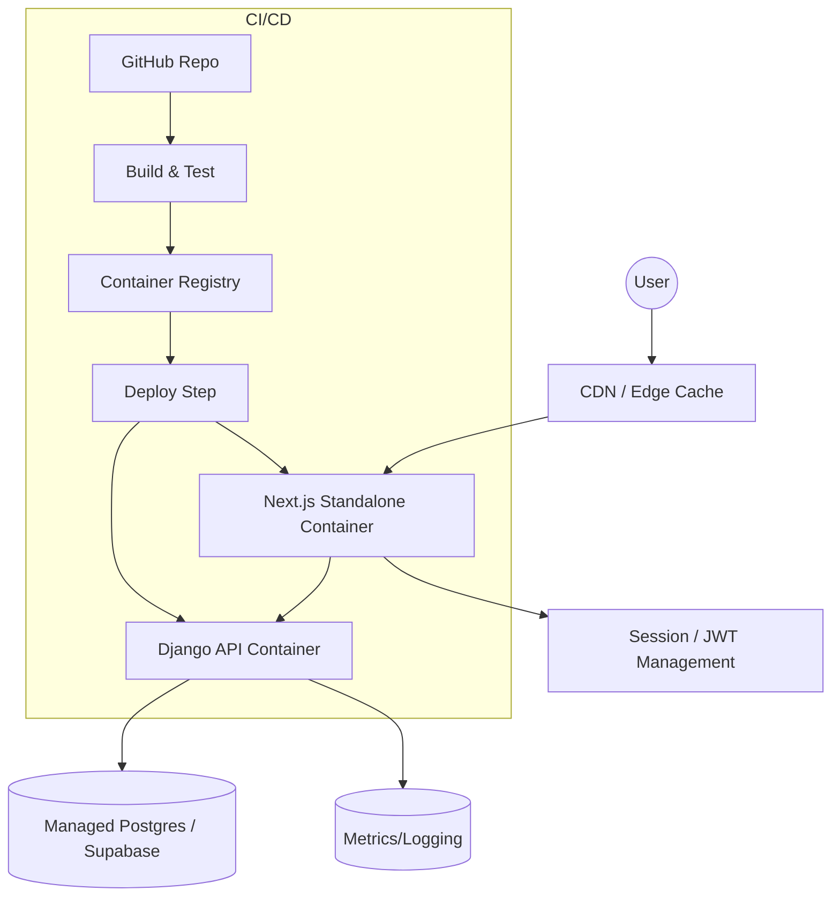
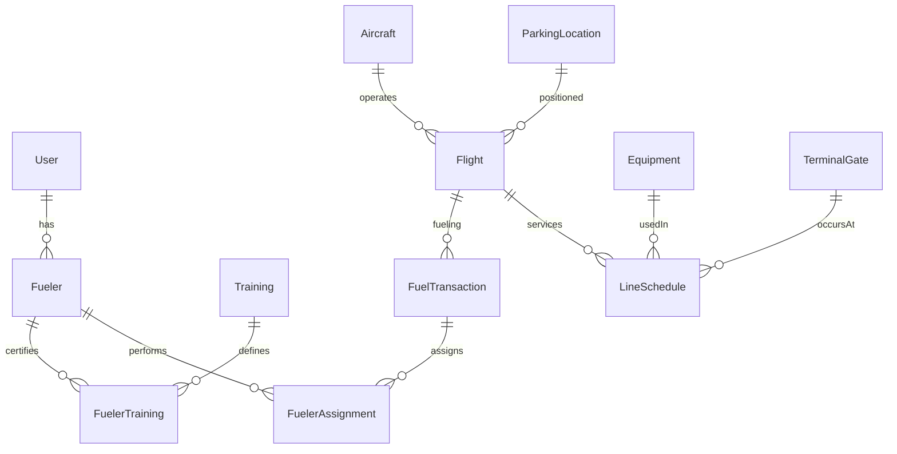

## Architecture Overview

This document explains how FBO Manager is structured across backend, frontend, shared packages, and infrastructure. It includes high‑level diagrams, deployment considerations, and data flow narratives.

### Goals

- Provide a modular foundation for FBO (Fixed Base Operator) operations: flight handling, fuel dispatch, training, equipment, scheduling.
- Maintain strict type alignment between backend serializers and frontend TypeScript via OpenAPI generation.
- Support multiple microsites (future expansion) with shared UI and types packages.
- Enable smooth local development via Docker Compose while remaining production‑ready for container orchestration (e.g., ECS, Kubernetes, or simple VM images).

---

## High-Level System Diagram

```mermaid
flowchart LR
    Browser[Web App (Next.js 16 / React 19)] -->|HTTPS / JWT Bearer| API[(Django REST Framework)]
    subgraph Frontend
      Browser --> AuthProvider[NextAuth Credentials]
      Browser --> UIShared[Shared UI Components]
      Browser --> TypesPkg[Generated API Types]
    end
    subgraph Backend
      API --> Auth[SimpleJWT]
      API --> BusinessLogic[ViewSets / Serializers]
      API --> DB[(PostgreSQL / Supabase)]
    end
    API --> OpenAPISchema[(drf-spectacular Schema)]
    OpenAPISchema --> Codegen[openapi-typescript-codegen]
    Codegen --> TypesPkg
```

### Request Flow
1. User authenticates via credentials (NextAuth) → obtains access + refresh JWT from `/api/auth/token/`.
2. Server actions or React code call typed client (`ApiClient`) or direct `fetch` with Bearer token.
3. DRF viewsets enforce permissions (default: read allows unauthenticated in dev; write restricted to admin).
4. Responses serialized → OpenAPI schema evolves → codegen updates types.
5. Token refresh occurs automatically when nearing expiry via NextAuth `jwt` callback hitting `/api/auth/refresh/`.

---

## Deployment Architecture (Recommended Production)



### Recommended Components
- Container Registry: GHCR / ECR / GCR
- Reverse Proxy: Nginx / Traefik for TLS termination & routing `/api/*` to Django, others to Next.
- Background Workers (future): Celery + Redis for async tasks (not yet needed, but architecture permits adding).

### Environment Separation
- Dev: Docker Compose (hot reload, wide CORS, debug logs)
- Staging: Same containers, seeded data, restricted CORS
- Prod: Hardened images, run DB migrations as init job, enforce HTTPS only, tightened CORS, secure secret storage (Vault / Parameter Store).

---

## Module Boundaries

| Domain                | Django Models / ViewSets                          | Frontend Usage                           |
|-----------------------|----------------------------------------------------|------------------------------------------|
| Authentication / User | `User`, `UserViewSet`, `UserManagementViewSet`     | Session provider, user context           |
| Flight Operations     | `Flight`, `FlightViewSet`, `ParkingLocation`       | Flight boards, scheduling dashboards     |
| Fuel Farm             | `FuelTank`, `TankLevelReading` viewsets & actions  | Tank monitoring UI                       |
| Fuel Dispatch         | `FuelTransaction`, `FuelTransactionViewSet`        | Dispatch assign/update workflows         |
| Training              | `Training`, `FuelerTraining`, related viewsets     | Certification status displays            |
| Personnel             | `Fueler`, `FuelerViewSet`                         | Fueler rosters & assignments             |
| Equipment             | `Equipment`, `EquipmentViewSet`                   | GSE inventory and maintenance tracking   |
| Line Service          | `LineSchedule`, `LineScheduleViewSet`             | Line operations scheduling & progress    |

---

## Data Access Patterns

- Read Patterns: Mostly list & detail viewsets with ordering/search filters for efficient server-side filtering.
- Mutation Patterns: Standard RESTful POST/PATCH/DELETE plus custom actions (`assign_fueler`, `update_progress`, `readings`, `active`, `by_airport`).
- Soft Delete: `ParkingLocationViewSet.destroy` sets `display_order=0` instead of deleting.
- Token Refresh: Access token proactively refreshed 5 minutes before expiry, minimizing failed calls.

---

## Security Considerations

- Authentication: JWTs signed with Django `SECRET_KEY`; refresh rotation enabled (`ROTATE_REFRESH_TOKENS=True`).
- Authorization: Admin-only mutations for sensitive resources; public read in development (tighten for production by replacing `AllowAnyReadOnly`).
- Transport: Enforce HTTPS at proxy layer; Web app should use secure cookies for session state if migrating away from pure JWT storage.
- Input Validation: DRF serializers + model validators (e.g., regex for `location_code`). Additional sanitization can be layered with custom serializer validation methods.

---

## Scaling Paths

| Concern          | Initial Approach                    | Scale Strategy                                      |
|------------------|--------------------------------------|----------------------------------------------------|
| Database         | Single Postgres instance             | Read replicas, partitioning (if flight volume grows) |
| API Throughput   | Single Django container              | Add gunicorn workers, horizontal autoscaling         |
| Background Tasks | Inline synchronous operations        | Introduce Celery + Redis for async workloads         |
| Static Assets    | Served by Next.js directly           | Offload to CDN / object storage                     |
| Authentication   | Stateful token refresh in app layer  | Central auth service / external IdP if needed       |

---

## Future Enhancements (Roadmap)

- Replace dev-wide unauthenticated reads with granular permission classes.
- Add audit logging (model signals → structured log output).
- Introduce tagging / categorization for equipment and flights.
- Implement WebSocket / SSE channel for real-time fuel transaction progress.
- Add caching layer (Redis) for frequently accessed aggregates (e.g., tank status summary).

---

## Diagram: Database Relationships Snapshot

See `database.md` for full ER diagram; simplified relationship overview:



---

## Operational Checklist (Production)

1. Build images: backend & frontend (`next build` prior to containerizing standalone output).
2. Run DB migrations job: `python manage.py migrate` before app start.
3. Rotate `SECRET_KEY` only with coordinated token invalidation.
4. Set CORS to allowed domains only.
5. Configure health endpoints (add `/api/health/` view) for load balancer checks.
6. Add structured logging (JSON) and ship to aggregation (ELK / Loki / CloudWatch).
7. Set resource limits (CPU/memory) for containers.
8. Enable monitoring (APM / metrics exporter) if traffic grows.

---

## Summary

The architecture balances rapid development (monorepo, codegen, permissive dev reads) with a clear path to production hardening (strict permissions, observability, scaling layers). The separation of concerns by domain keeps complexity manageable while enabling future expansion (events, background tasks, real‑time channels).
