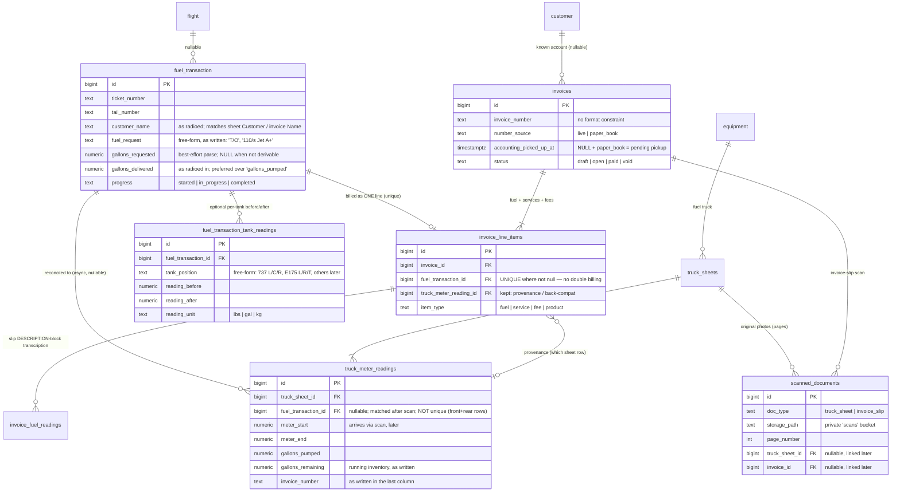

# Fuel Dispatch → Truck Sheets → Invoicing: workflow architecture

Status: **proposal** (schema drafted, not yet applied to the live database).
Migration: `frontend/scripts/fuel-invoicing-workflow-schema.sql` (production, run manually via the Supabase SQL editor / `psql`) mirrored by `frontend/supabase/migrations/20260703000300_fuel_invoicing_workflow.sql` (local test stack).

This resolves the long-open "fuel_transactions-to-invoice" design question (flagged since PR #15). It is modeled directly on the real paper workflow on the ramp, as described by the night-shift operator who will be scanning the sheets in — the operational nuances below are requirements, not color.

## The paper reality being modeled

Two distinct physical documents exist today:

**1. Truck sheet** ("2025/2026 Truck Sheet Jet A v4") — one per truck per day, the daily meter log. Columns, left to right:

| Column | Notes |
|---|---|
| Customer | matches the invoice's *Name* field ("Life Flight", "UA 5996") |
| Tail Number | matches across both documents |
| Aircraft Type | e.g. B737, E175, 182 |
| "Circle YES" | paper-only fuel-type verification mark |
| Meter Start / Meter End | mechanical register readings; small trailing digit = tenths |
| Gallons Pumped | should equal meter end − start |
| Starting / Remaining Gallons | hand-kept running truck inventory (see below) |
| Prist? Yes/No | Jet A only |
| Line Tech initials | |
| Invoice No. & Time | invoice number on top, time below, **written in after the invoice exists** — this is the physical correlation mechanism today |

**2. Invoice slip** — carbon-copy page from a pre-printed invoice book ("MAI — Minuteman Aviation Inc"). Fields: Aircraft No., Aircraft Type, Date, Name, Address, meter reading at stop, less reading start, total gallons delivered, and a **pre-printed 5-digit invoice number in red** (e.g. "21483").

Correlation between the two: truck sheet *Customer* = invoice *Name*; *tail number* matches; the line tech writes the invoice number + initials + time into the truck sheet's last column after the invoice is generated.

## Two invoice-number regimes (different timing semantics)

| | Dash format (`26-3330`) | 5-digit book serial (`21483`) |
|---|---|---|
| Who | GA / most ramp traffic | Airlines, primarily |
| Issued by | Current accounting software, **live**: line tech radios the fueling in, front desk creates the invoice on the spot and reads the number back | Pre-printed in the paper invoice book |
| Timing | Immediate — the number exists before the truck sheet column is filled in | Slip filled by hand at fueling time; top copy dropped in a box; **accounting collects around midday** — a real, expected batch delay |
| Schema | `invoices.number_source = 'live'` | `invoices.number_source = 'paper_book'`; **pending pickup** = `accounting_picked_up_at IS NULL` |

The pending-pickup state is deliberately **derived** (`number_source + accounting_picked_up_at`), not a new `status` enum value — the existing draft/open/paid/void lifecycle is orthogonal to whether accounting has physically collected the carbon copy. `invoices.repo.ts` exposes `inferNumberSource()`, `isPendingAccountingPickup()` and `markAccountingPickedUp()`.

No format CHECK constrains `invoice_number`: hand-written numbers are messy, and rejecting them violates the resilience posture below.

## Entity model



Key relationship decisions:

- **`fuel_transaction` ⇄ `truck_meter_readings`**: the FK lives on the *reading* (`truck_meter_readings.fuel_transaction_id`) because the reading is the later-arriving record that gets matched back. It is intentionally **not unique** — one large fueling can legitimately span two sheet rows (front + rear register on Jet A trucks). Double-billing is prevented one level up, where it actually matters.
- **`fuel_transaction` → `invoice_line_items`**: a fueling becomes exactly **one** line item on an invoice; other line items (GPU, oil, ramp fees, de-ice…) are added to the same invoice separately. `uq_invoice_line_items_fuel_transaction` (partial unique index) makes billing the same fueling twice a database error, extending the existing `truck_meter_reading_id` unique-index pattern. `ON DELETE RESTRICT` means a billed dispatch record can't be deleted out from under its invoice — void the invoice first (voiding clears the link and frees the uniqueness slot).
- **`truck_meter_reading_id` on line items is kept** for provenance (which physical sheet row supplied the meter numbers) and because existing rows use it. `fuel_transaction_id` is the primary billing link going forward.

## Workflow

```mermaid
sequenceDiagram
    autonumber
    participant LT as Line tech (ramp)
    participant FD as Front desk
    participant APP as App (repos + Supabase)
    participant ACC as Accounting

    Note over LT,APP: A. Fueling happens (both regimes)
    LT->>FD: Radio: customer, tail number, gallons pumped, request text
    FD->>APP: createTransaction(tail, customer_name, fuel_request, gallons_delivered)
    Note right of APP: No meter numbers — too much<br/>data entry over the radio.

    alt GA / live regime (dash number, e.g. 26-3330)
        FD->>ACC: Create invoice in accounting software (immediately)
        ACC-->>FD: Invoice number 26-3330
        FD-->>LT: Number read back over the radio
        LT->>LT: Writes 26-3330 + initials + time on the truck sheet
        FD->>APP: createInvoice(number_source='live',<br/>fuelLine.fuelTransactionId)
    else Airline / paper-book regime (5-digit serial, e.g. 21483)
        LT->>LT: Fills carbon-copy slip by hand at the aircraft<br/>(incl. per-tank before/after readings)
        LT->>LT: Drops top copy in the box; writes 21483 on the truck sheet
        FD->>APP: createInvoice(number_source='paper_book') → pending pickup
        FD->>APP: replaceTankReadings(txId, [L/C/R or L/R/T …])
        ACC->>ACC: Midday box pickup
        ACC->>APP: markAccountingPickedUp(invoiceId)
    end

    Note over LT,APP: B. Night scan → async reconciliation (days later is fine)
    LT->>APP: Upload truck-sheet photos (multi-page ok)
    APP->>APP: OCR (Claude) → truck_sheets + truck_meter_readings<br/>with the real Meter Start/End numbers
    APP->>APP: uploadScannedDocument() — original photos persisted<br/>to the private 'scans' bucket
    APP->>APP: findMatchCandidates(tail, sheet date) per reading
    FD->>APP: linkReadingToTransaction(readingId, txId)<br/>(backfills gallons_delivered if dispatch never got it)

    Note over FD,APP: C. Billing the queue
    FD->>APP: findUninvoicedTransactions() — completed, unbilled
    FD->>APP: createInvoice(fuelLine.fuelTransactionId, + service lines)
    APP->>APP: unique index rejects a second billing of the same fueling
```

Every step in section B is optional and out-of-order-tolerant — see the resilience posture below.

## What is live vs. reconstructed later

Meter numbers are **rarely entered live**. A dispatch-time `fuel_transaction` typically carries only: tail number, customer, `fuel_request` (free-form, exactly as written/radioed — renamed from `fuel_order_text`; the dispatch UI already labeled it "Fuel Request"), `gallons_requested` (best-effort parse of the request via `parseGallonsRequested()`; `'T/O'`, `'Fill'`, and lbs requests stay `NULL`), and `gallons_delivered` (the number radioed in — this name is preferred over "gallons pumped"; the legacy QT-era `quantity_gallons` is untouched). The real Meter Start/End arrive when the sheet is scanned, on `truck_meter_readings`, and flow back through the reconciliation link.

## Per-tank readings (airlines only)

Airline fuelings record before/after fuel per tank on the invoice slip and per-airline paperwork. The two aircraft types serviced today: **737 = L/C/R**, **E175 = L/R/T**. `fuel_transaction_tank_readings.tank_position` is free-form TEXT **by design** — a new aircraft type must never require a migration. Unit defaults to lbs (gauge readings). GA fuelings simply have no rows. (`invoice_fuel_readings` remains what it always was: a transcription of the printed DESCRIPTION block on a ticket; the new table is the transaction-side record.)

## "Remaining Gallons" — per-truck running inventory

Each sheet row's remaining gallons = previous remaining (or the day's starting gallons) − gallons pumped, with tank fills / transfers-in adding fuel back. Done by hand today, so the hand-written value is fallible. The `truck_sheet_running_totals` view derives the expected value per row (`starting_gallons` + windowed sum over the ordered rows) **beside** the as-written value, so the UI can surface discrepancies rather than silently trusting either.

`~/src/minuteman` was checked per the standing copy-exactly instruction: its fuel-farm module tracks the **farm tanks** (T1–T7, LF) via inches→gallons calibration tables and has no per-truck running-total logic. Nothing to copy; the view is new logic. (Minuteman's farm-tank model was already ported here as `tank_level_readings` / `tanks.repo.ts`.)

## Original scan persistence (Supabase Storage)

Today only OCR-extracted JSON survives; the photos are discarded. New:

- Private bucket **`scans`**, access via signed URLs only (business paperwork). RLS on `storage.objects` scoped to the bucket, house-style authenticated policy.
- **`scanned_documents`** metadata table: `doc_type` (`truck_sheet` | `invoice_slip`), `storage_path` (`{doc_type}/{yyyy}/{mm}/{uuid}-{filename}`), `page_number` for multi-page sheets, nullable `truck_sheet_id` / `invoice_id` — a scan can exist before anyone knows what it belongs to.
- The truck-sheet import flow (`use-truck-sheet-import.ts`) now uploads the original photos on commit, best-effort: a storage failure logs and does not roll back a successful data import (the photos still exist on the phone).
- Repository: `frontend/repositories/scanned-documents.repo.ts`.

**Invoice-slip ingestion (designed, not yet built):** slips are a second OCR layout — fields per the paper description above (Aircraft No., Aircraft Type, Date, Name, Address, meter stop / less meter start / total gallons delivered, red 5-digit serial, tank readings in the description area). A future `app/api/ocr/invoice-slip/route.ts` would mirror the truck-sheet route, then: match by the red serial → `invoices.invoice_number` (creating a `paper_book` invoice if absent), correlate to `fuel_transaction` by tail number + date, and attach the scan via `scanned_documents.invoice_id`. The schema and storage above already accept these; only the OCR route and review UI are future work.

## Data-resilience posture (hard requirement)

Sheets will not be scanned consistently — some days yes, some days no, for months. Therefore:

- Every cross-entity link is **nullable and populated after the fact**: transaction without a reading, reading without a transaction, invoice without either — all valid indefinitely.
- No all-or-nothing constraints; the only hard constraint is the double-billing guard, which protects money, not completeness.
- Matching (`findMatchCandidates`) is deliberately loose — tail number + sheet date ± 1 day — and human-confirmed, not auto-committed.
- Nothing rejects malformed hand-written values (no invoice-number format checks, `gallons_requested` never guessed).

## Future phase — AI chatbot intake (explicitly out of scope now)

Long-term idea: line techs "call in a fueling" by talking to a chatbot (tail number + gallons), which creates the `fuel_transaction` directly and could ask clarifying questions about ambiguous scans. **Not built now.** The only current obligation is honored: `createTransaction()` in `transactions.repo.ts` is a clean, UI-independent repository function taking exactly the radioed-in minimum — a future chatbot tool-call plugs into it (and into `findUninvoicedTransactions()` for the front-desk queue) without a rewrite.

## Deliberate judgment calls / open questions for review

1. **`fuel_order_text` renamed to `fuel_request`** (spec'd name; UI already said "Fuel Request"). Rename is guarded in the migration; if live rows/tooling depend on the old name elsewhere, flag it.
2. **`customer_name` added to `fuel_transaction`** — not explicitly in the spec, but the radioed call includes the customer and the front-desk queue needs someone to bill. Cut it if dispatch should stay tail-number-only.
3. **Reading→transaction link non-unique** (dual-register fuelings). If 1:1 should be enforced instead, add a partial unique index and split dual-register fuelings into two transactions.
4. **`ON DELETE RESTRICT`** for billed transactions (vs. `SET NULL`): protects billing integrity at the cost of a two-step delete (void first).
5. **Backfill**: existing invoices get `number_source` classified by number shape (5 digits = book serial), and existing non-draft book invoices get `accounting_picked_up_at = created_at` (they're in the system, so presumably collected). Existing billed `truck_meter_readings` do **not** get synthetic `fuel_transaction` rows — old lines stay on `truck_meter_reading_id` only.
6. **Pending pickup as derived state**, not a `status` value — keeps the settlement lifecycle untouched.
